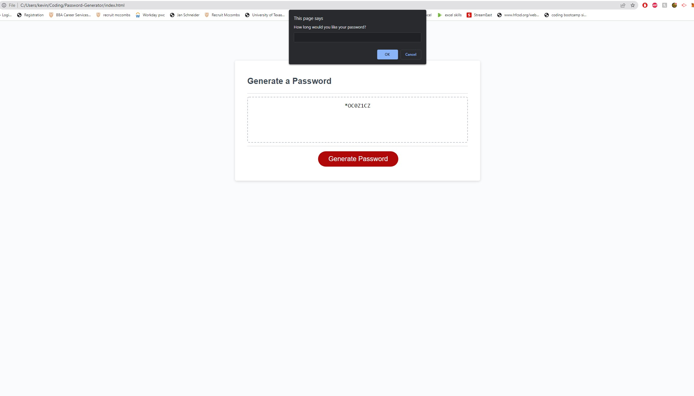

# Password-Generator

## Javascript Password Generator

My motivation today is to create a password generator that utilizes lowercase, uppercase, numeric, and/or special characters. The Javascript will create a randomized password that will have a length of at least 8 characters and no more than 128 characters. For this to be achieved the following must be answered:
 
 
* When the buttom is clicked a series of prompts for password criteria must be shown
* The user must be able to select which type of criteria to include in the password
* The length of the password must be at least 8 characters or 128 characters or else return null
* After each input is confirmed the input should be validated and one character type should be selected
* The password is generated that matches the selected criteria and is displayed or written to the page

## Usage
This is to demonstrate the usage of javascript to produce a random password to be used. 
 
## Demo
https://darrelwu.github.io/Personal-Portfolio-Page/

 

 
## License
 
MIT License
 
Copyright (c) [2022] [Darrelwu]
Permission is hereby granted, free of charge, to any person obtaining a copy of this software and associated documentation files (the "Software"), to deal in the Software without restriction, including without limitation the rights to use, copy, modify, merge, publish, distribute, sublicense, and/or sell copies of the Software, and to permit persons to whom the Software is furnished to do so, subject to the following conditions:
The above copyright notice and this permission notice shall be included in all copies or substantial portions of the Software.
THE SOFTWARE IS PROVIDED "AS IS", WITHOUT WARRANTY OF ANY KIND, EXPRESS OR IMPLIED, INCLUDING BUT NOT LIMITED TO THE WARRANTIES OF MERCHANTABILITY, FITNESS FOR A PARTICULAR PURPOSE AND NONINFRINGEMENT. IN NO EVENT SHALL THE AUTHORS OR COPYRIGHT HOLDERS BE LIABLE FOR ANY CLAIM, DAMAGES OR OTHER LIABILITY, WHETHER IN AN ACTION OF CONTRACT, TORT OR OTHERWISE, ARISING FROM, OUT OF OR IN CONNECTION WITH THE SOFTWARE OR THE USE OR OTHER DEALINGS IN THE SOFTWARE.